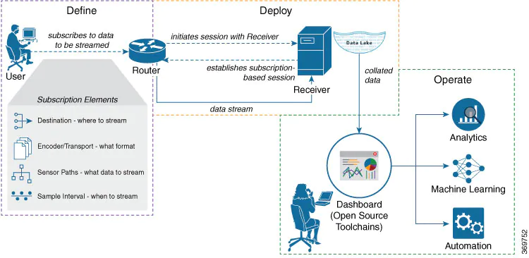

# MDT practical with Cisco IOS-XR

- [MDT practical with Cisco IOS-XR](#mdt-practical-with-cisco-ios-xr)
  - [IOS-XR Router Configuration](#ios-xr-router-configuration)
    - [MDT Configuration Options](#mdt-configuration-options)
    - [Define a Subscription to Stream Data from Router to Receiver](#define-a-subscription-to-stream-data-from-router-to-receiver)
    - [Verify Deployment of the Subscription](#verify-deployment-of-the-subscription)

## IOS-XR Router Configuration

There are different options to configure Model Driven Telemetry on Cisco IOS XR routing platform related to transport, session initiation and encoding. When these options are chosen the MDT subscriptions are defined using configuration or dynamically via gNMI protocol.

### MDT Configuration Options

- **Transport**: The router can deliver telemetry data either across using TCP or gRPC over HTTP/2. Some people will prefer the simplicity of a raw TCP socket, others will appreciate the optional TLS encyption that gRPC brings.
- **Session Initiation**: There are two options for initiating a telemetry session. The router can “dial-out” to the collector or the collector can “dial-in” to the router. Regardless of which side initiates the session, the router always streams the data to the collector at the requested intervals. TCP supports “dial-out” while gRPC supports both “dial-in” and “dial-out.”
- **Encoding**: The router can deliver telemetry data in two different flavors of Google Protocol Buffers: Compact and Self-Describing GPB. Compact GPB is the most efficient encoding but requires a unique .proto for each YANG model that is streamed. Self-describing GPB is less efficient but it uses a single .proto file to decode all YANG models because the keys are passed as strings in the .proto.

### Define a Subscription to Stream Data from Router to Receiver

In our example we establish a Model-Driven Telemetry Session from a Router to a Collector.
Telemetry involves the following workflow:

- **Define**: You define a subscription to stream data from the router to the receiver. To define a subscription, you create a destination-group and a sensor-group.
- **Deploy**: The router establishes a subscription-based telemetry session and streams data to the receiver. You verify subscription deployment on the router.
- **Operate**: You consume and analyse telemetry data using open-source tools, and take necessary actions based on the analysis. We are providing a MDT telemetry stack which includes Telegraf, InfluxDB, Chronograf and Grafana to consume data streamed by the router.



**Step 1.** Create a destination to collect Telemetry data from a router

Using CLI:

```console
!
telemetry model-driven
 destination-group docker-server
address-family ipv4 10.58.244.75 port 57000
   encoding self-describing-gpb
   protocol grpc no-tls
  !
 !
 ```

where:

- docker-server is the name of the destination-group
- 10.58.244.75 is the IP address of the destination where data is to be streamed
- 57000 is the port number of the destination
- self-describing-gpb is the format in which data is encoded and streamed to the destination
- grpc is the protocol through which data is transported to the destination.
- no-tls indicates tls option for gRPC is not used

The destination for dial-out configuration supports IP address (Ipv4 or IPv6), and fully qualified domain name (FQDN) using domain name services (DNS). To use FQDN, you must assign IP address to the domain name.The domain name is limited to 128 characters. If DNS lookup fails for the provided domain name, the internal timer is activated for 30 sec. With this, the connectivity is continually tried every 30 sec until the domain named is looked-up successfully.

**Step 2.** Specify the subset of the data that you want to stream from the router using sensor paths. The sensor path represents the path in the hierarchy of a YANG data model. Create a sensor-group to contain the sensor paths.

Using CLI:

```console
 sensor-group example
  sensor-path openconfig-interfaces:interfaces/interface/state
 !   
 ```

 where:

- example is the name of the sensor-group
- openconfig-interfaces:interfaces/interface/state is the sensor path from where data is streamed.

**Step 3.** Subscribe to telemetry data that is streamed from a router. A subscription binds the destination-group with the sensor-group and sets the streaming method. The streaming method can be cadence-driven or event-driven telemetry.

`Note: The configuration for event-driven telemetry is similar to cadence-driven telemetry, with only the sample interval as the differentiator. Configuring the sample interval value to 0, zero, sets the subscription for event-driven telemetry, while configuring the interval to any non-zero value sets the subscription for cadence-driven telemetry.`

```console
 subscription example
  sensor-group-id example sample-interval 10000
  destination-id docker-server
 ! 
```

Where:

- example is the name of the subscription
- example is the name of the sensor-group
- docker-server is the name of the destination-group
- 10000 is the sample interval in milliseconds. The sample interval is the time interval between two streams of data. In this example, the sample interval is 10000 milliseconds or 10 seconds.

`Note: one can add a source interface definition. It is the source interface that is used for establishing the telemetry session. If both the VRF and source interface are configured, the source interface must be in the same VRF as the one specified in the destination group.`

### Verify Deployment of the Subscription

**Step 1.** View the model-driven telemetry configuration on the router

```console
RP/0/RP0/CPU0:xr9kv-3#show running-config telemetry model-driven 
Mon Jun 14 11:39:31.453 UTC
telemetry model-driven
 destination-group docker-server
  address-family ipv4 10.58.50.220 port 57001
   encoding self-describing-gpb
   protocol grpc no-tls
  !
 !
 sensor-group example
  sensor-path openconfig-interfaces:interfaces/interface/state
 !
 subscription example
  sensor-group-id example sample-interval 10000
  destination-id docker-server
  source-interface Loopback0
 !        
!
```

**Step 2.** Verify the state of the subscription. An Active state indicates that the router is ready to stream data to the receiver based on the subscription.

Show Telemetry Sensor Group

```console
RP/0/RP0/CPU0:xr9kv-3#show telemetry model-driven sensor-group example 
Mon Jun 14 11:37:11.570 UTC
  Sensor Group Id:example
    Sensor Path:        openconfig-interfaces:interfaces/interface/state
    Sensor Path State:  Resolved
```

Show Telemetry Subscription

```console
RP/0/RP0/CPU0:xr9kv-3#show telemetry model-driven subscription example 
Mon Jun 14 11:37:56.615 UTC
Subscription:  example
-------------
  State:       ACTIVE
  Source Interface:       Loopback0(Up 0x60000000)
  Sensor groups:
  Id: example
    Sample Interval:      10000 ms
    Sensor Path:          openconfig-interfaces:interfaces/interface/state
    Sensor Path State:    Resolved

  Destination Groups:
  Group Id: docker-server
    Destination IP:       10.58.50.220
    Destination Port:     57001
    Encoding:             self-describing-gpb
    Transport:            grpc
    State:                Active
    TLS :                 False
    Total bytes sent:     277670494
    Total packets sent:   3884
    Last Sent time:       2021-06-14 11:37:55.1239304674 +0000

  Collection Groups:
  ------------------
    Id: 59
    Sample Interval:      10000 ms
    Encoding:             self-describing-gpb
    Num of collection:    7
    Collection time:      Min:   114 ms Max:   156 ms
    Total time:           Min:   114 ms Avg:   130 ms Max:   156 ms
    Total Deferred:       0
    Total Send Errors:    0
    Total Send Drops:     0
    Total Other Errors:   0
    No data Instances:    0
    Last Collection Start:2021-06-14 11:37:56.1239992829 +0000
    Last Collection End:  2021-06-14 11:37:46.1230110452 +0000
    Sensor Path:          openconfig-interfaces:interfaces/interface/state

    Id: 60
    Sample Interval:      10000 ms
    Encoding:             self-describing-gpb
    Num of collection:    7
    Collection time:      Min:    52 ms Max:    68 ms
    Total time:           Min:    53 ms Avg:    58 ms Max:    68 ms
    Total Deferred:       0
    Total Send Errors:    0
    Total Send Drops:     0
    Total Other Errors:   0
    No data Instances:    0
    Last Collection Start:2021-06-14 11:37:46.1230110848 +0000
    Last Collection End:  2021-06-14 11:37:46.1230169636 +0000
    Sensor Path:          openconfig-interfaces:interfaces/interface/state
```
